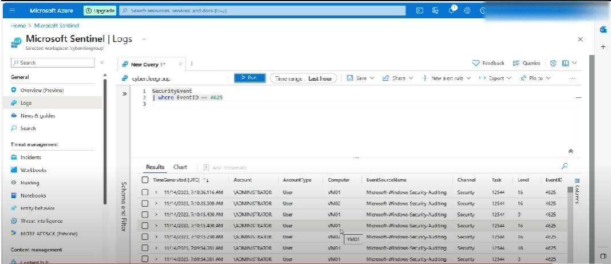

<h1>Importance of endpoint system security</h1>

 ### [YouTube Demonstration](https://www.youtube.com/watch?v=edycb0rOAKQ)

<h2>Description</h2>
Using Microsoft Azure, I created a network of virtual machines to represent an organization. I then secured two of the machines and exposed the third machine to raw internet. The purpose of this experiment is to show the importance of maintaining security on all devices on a network because malicious attackers are always trying to attack vulnerable systems. The success of the exercise shows that with proper security protocols in place the threat vector from failed attempted logins can be greatly reduced to near 0.
<br />


<h2>Utilities Used</h2>

- <b>Microsoft AZURE</b> 
- <b>Microsoft Sentinel</b>

<h2>Environments Used </h2>

- <b>Windows 10</b>

<h2>Walk-through:</h2>

<p align="center">
Started by loading the AZURE homescreen seen below: <br/>

<br />
<br />
Selected Virtual machines and followed the steps to create  virtual machines including creating usernames and passwords for all VM's:  <br/>

<br />
<br />
Create a Log Analytic Workstation to recive all logs from the virtual machines: <br/>

<br />
<br />
Connect all virtual machines to the Log analytics Workstation. This process can take several minutes:  <br/>

<br />
<br />
After the log analytics workstation has connected to all virtual machines it is time to create a SIEM tool using Microsoft Sentinel to scan the logs coming from our virtual machines. Select Microsoft Sentinel form the home page of the Azure Portal and follow the steps to activate Microsoft Sentinel:  <br/>

<br />
<br />
Once Microsoft Sentinel has been installed you have to download and activate connectors for Sentinel. Once the Connectors are online you ready to scan for security logs with Microsoft Sentinel :  <br/>

<br />
<br />
Finally, we can test the integrity of the security of our network. We secured one virtual machine by closing all unnecessary ports and setting up windows defender. The other machines were not secure and were exposed to the raw internet. Using Microsoft Sentinel, we can see that in just a short time we have several attempts to remotely access our virtual machines by unauthorized individuals. The results below show VM 2 and VM 3 have several failed logins attempts indicating these systems are vulnerable to attack and VM 1 has none proving that it is secure. This shows the importance of proper security on endpoint systems.:  <br/>

</p>

<!--
 ```diff
- text in red
+ text in green
! text in orange
# text in gray
@@ text in purple (and bold)@@
```
--!>
